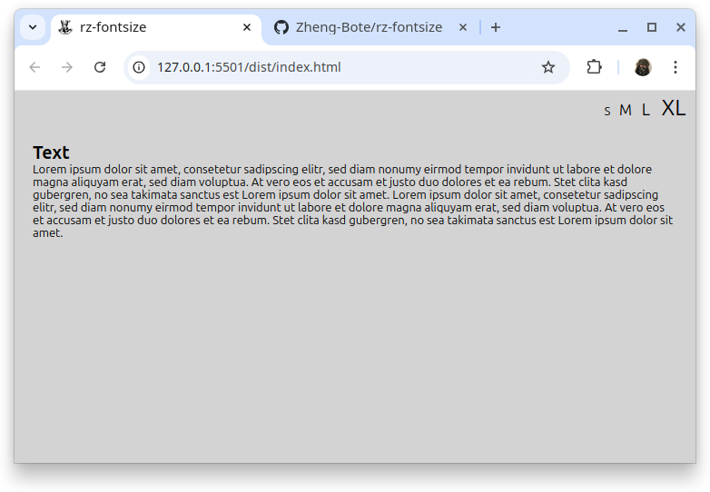
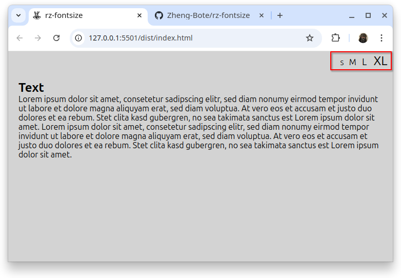
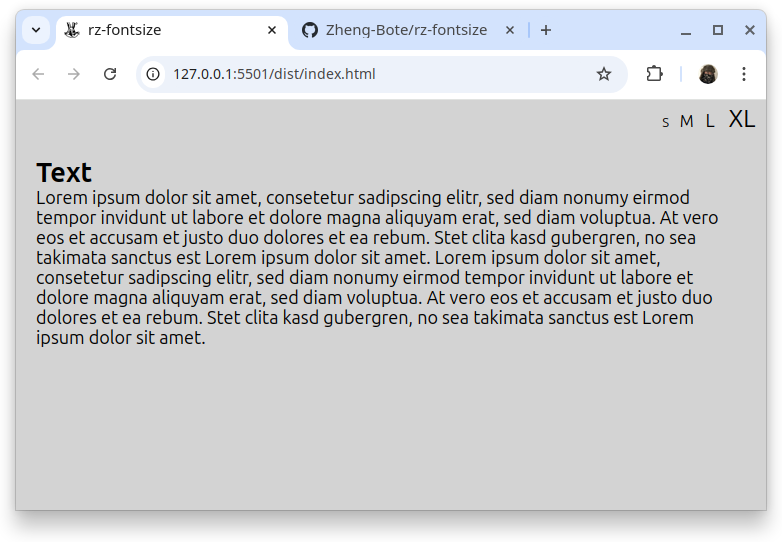
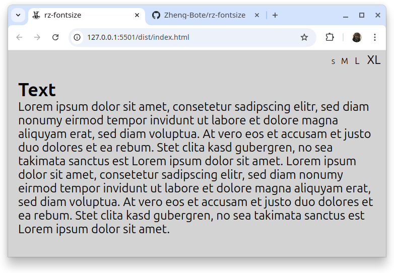

<div id="top" align="center">
<h1>rz-fontsize</h1>

<p>A Web Component to change Font-Size</p>

[Report Issue](https://github.com/Zheng-Bote/rz-fontsize/issues) [Request Feature](https://github.com/Zheng-Bote/rz-fontsize/pulls)

[](https://choosealicense.com/licenses/mit/)


</div>

<hr>

<!-- START doctoc generated TOC please keep comment here to allow auto update -->
<!-- DON'T EDIT THIS SECTION, INSTEAD RE-RUN doctoc TO UPDATE -->

**Table of Contents**

- [Description](#description)
  - [Features](#features)
  - [Status](#status)
    - [Application / Tool](#application--tool)
    - [Documentation](#documentation)
      - [README](#readme)
      - [other Markdown files](#other-markdown-files)
- [Installation](#installation)
  - [Dependencies](#dependencies)
  - [folder structure](#folder-structure)
  - [Usage/Examples/Tests](#usageexamplestests)
- [API Reference](#api-reference)
  - [Inputs](#inputs)
  - [Outputs](#outputs)
  - [Parameters](#parameters)
- [Documentation](#documentation-1)
  - [Architecture](#architecture)
    - [Github](#github)
      - [Github Repo](#github-repo)
      - [Github Actions / Workflows](#github-actions--workflows)
  - [Application](#application)
  - [DevOps](#devops)
  - [Github Page](#github-page)
  - [Github Wiki](#github-wiki)
  - [Comments](#comments)
  - [Screenshots](#screenshots)
- [Authors and License](#authors-and-license)
  - [License](#license)
    - [MIT License](#mit-license)
    - [Apache License](#apache-license)
  - [Authors](#authors)
    - [Code Contributors](#code-contributors)

<!-- END doctoc generated TOC please keep comment here to allow auto update -->

<hr>

# Description


A Web Component to change Font-Size

### Features

- \[ ] advanced-super-extra-special feature xyz

  <br>

- \[x] OSS and license
- \[x] works as designed
- \[ ] no bugs

<br>

- \[x] runs on modern Internet Browsern with enabled Javascript

<p align="right">(<a href="#top">back to top</a>)</p>

## Status


# Documentation

## Usage

```html
<rz-fontsize></rz-fontsize>
```

### html example

```html
<!DOCTYPE html>
<html lang="en">
  <head>
    <meta charset="UTF-8" />
    <link rel="icon" type="image/svg+xml" href="favicon.svg" />
    <meta name="viewport" content="width=device-width, initial-scale=1.0" />
    <title>rz-fontsize</title>
    <script
      type="module"
      crossorigin
      src="rz-fontsize/index-DnqJ-12L.js"
    ></script>
  </head>
  <body>
    <header>
      <rz-fontsize> </rz-fontsize>
    </header>
    <main>
      <h2>Text</h2>
      <p class="txt">
        Lorem ipsum dolor sit amet, consetetur sadipscing elitr, sed diam nonumy
        eirmod tempor invidunt ut labore et dolore magna aliquyam erat, sed diam
        voluptua. At vero eos et accusam et justo duo dolores et ea rebum. Stet
        clita kasd gubergren, no sea takimata sanctus est Lorem ipsum dolor sit
        amet. Lorem ipsum dolor sit amet, consetetur sadipscing elitr, sed diam
        nonumy eirmod tempor invidunt ut labore et dolore magna aliquyam erat,
        sed diam voluptua. At vero eos et accusam et justo duo dolores et ea
        rebum. Stet clita kasd gubergren, no sea takimata sanctus est Lorem
        ipsum dolor sit amet.
      </p>
    </main>
  </body>
</html>
```

> \[!TIP]
> see also `./index.html`

<p align="right">(<a href="#top">back to top</a>)</p>

# Screenshots

**small**



**default: Medium**



**Large**



**X-Large**



<p align="right">(<a href="#top">back to top</a>)</p>

# Installation

```bash
npm install
npn run build
```

- copy content of folder `dist/*` into your web folder
- add `<script type="module" src="<path/to/>rz-fontsize.js"></script>` to your html-header
- add `<rz-fontsize />` to the body of your html-file (don't forget the attributes).

## Dependencies


Simple. Fast. Web Components.

Lit is a simple library for building fast, lightweight web components.

[Lit.js](https://lit.dev/)

## folder structure

<!-- readme-tree start -->

<!-- readme-tree end -->

<p align="right">(<a href="#top">back to top</a>)</p>

# Authors and License

## License

[](https://choosealicense.com/licenses/mit/)

Copyright (c) 2025 ZHENG Robert

Permission is hereby granted, free of charge, to any person obtaining a copy
of this software and associated documentation files (the "Software"), to deal
in the Software without restriction, including without limitation the rights
to use, copy, modify, merge, publish, distribute, sublicense, and/or sell
copies of the Software, and to permit persons to whom the Software is
furnished to do so, subject to the following conditions:

The above copyright notice and this permission notice shall be included in all
copies or substantial portions of the Software.

THE SOFTWARE IS PROVIDED "AS IS", WITHOUT WARRANTY OF ANY KIND, EXPRESS OR
IMPLIED, INCLUDING BUT NOT LIMITED TO THE WARRANTIES OF MERCHANTABILITY,
FITNESS FOR A PARTICULAR PURPOSE AND NONINFRINGEMENT. IN NO EVENT SHALL THE
AUTHORS OR COPYRIGHT HOLDERS BE LIABLE FOR ANY CLAIM, DAMAGES OR OTHER
LIABILITY, WHETHER IN AN ACTION OF CONTRACT, TORT OR OTHERWISE, ARISING FROM,
OUT OF OR IN CONNECTION WITH THE SOFTWARE OR THE USE OR OTHER DEALINGS IN THE
SOFTWARE.

        https://choosealicense.com/licenses/mit/

## Authors

- [](https://www.github.com/Zheng-Bote)

### Code Contributors


[](https://www.github.com/Zheng-Bote)

<hr>

:vulcan_salute:

<p align="right">(<a href="#top">back to top</a>)</p>
